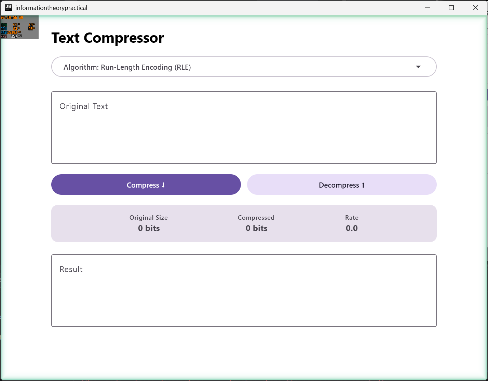
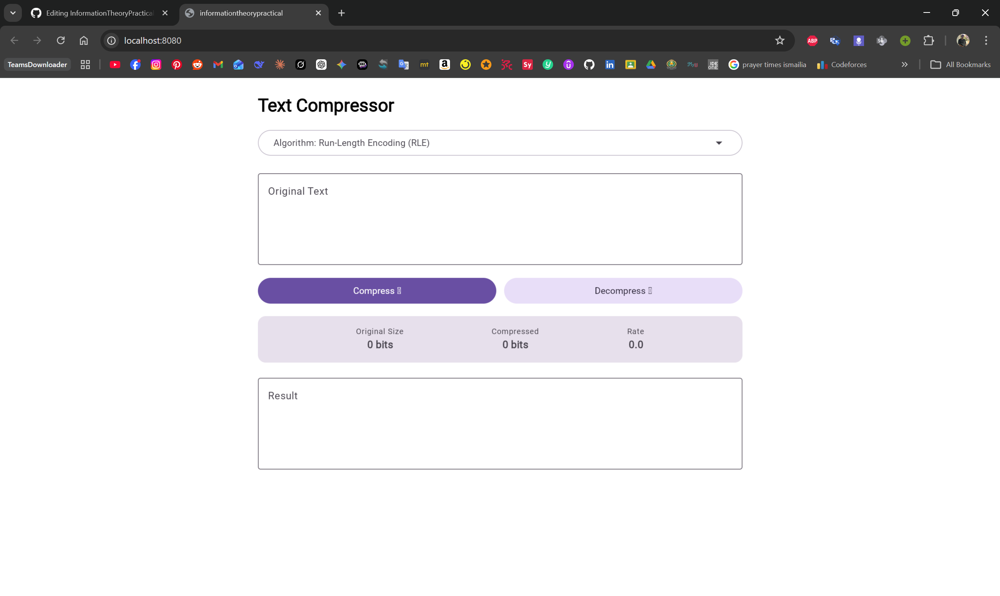
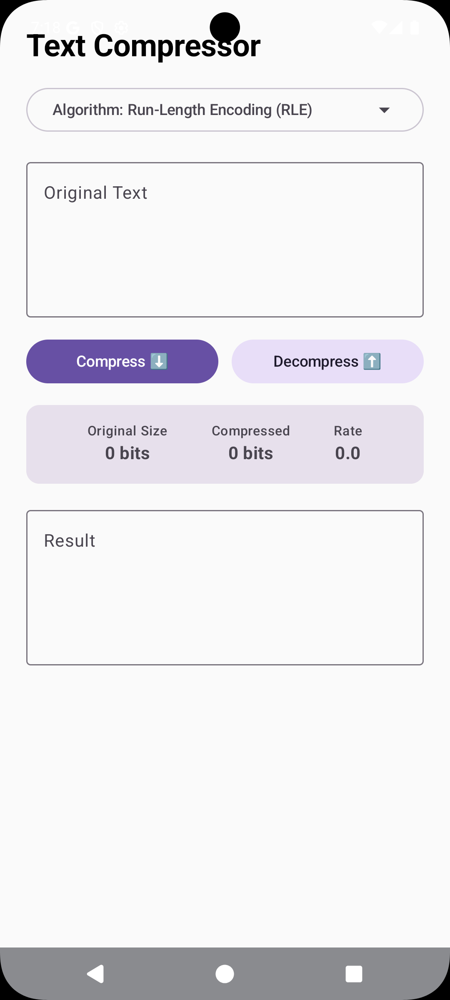

# Information Theory Practical Project


A cross-platform application built for Windows, Android, and the Web to demonstrate the "Big 5" core data compression algorithms for my Information Theory practical coursework at Suez Canal University.

## 📥 Downloads & Releases

You can download the ready-to-run packaged versions of the application directly from the **[Releases](https://github.com/Sherif-Moheep/InformationTheoryPractical/releases)** tab on GitHub:
* **🪟 Windows:** Download the standalone `.exe` installer.
* **📱 Android:** Download and install the `.apk` file directly to your device.
* **🌐 Web:** [Click here to use the live web version](https://sherif-moheep.github.io/InformationTheoryPractical/) *(Note: Make sure GitHub Pages is enabled in your repo settings!)*

## 📸 Screenshots

| Desktop (Windows) | Web Browser | Mobile (Android) |
| :---: | :---: | :---: |
|  |  |  |
| *Native Windows application.* | *Zero-install Web version running via Wasm/JS.* | *Responsive layout powered by Compose Multiplatform.* |

## ✨ Features

* **Compose Multiplatform:** Runs seamlessly on Windows, Android, and Web from a single shared UI codebase.
* **5 Core Algorithms:** Complete from-scratch implementation of classic source coding and dictionary compression techniques.
* **Bit-Level Metrics:** Accurately calculates true memory savings by converting standard string lengths into exact bit-sizes.
* **Clean Architecture:** Strictly enforces separation of concerns. UI has zero knowledge of algorithmic math, completely decoupled via Domain Use Cases.
* **Dependency Injection:** Utilizes **Koin** to dynamically inject specific algorithm "chefs" based on the user's dropdown selection.
* **Unidirectional Data Flow (UDF):** Manages UI state safely and predictably using a Multiplatform `ViewModel` and Kotlin `StateFlow`.

## 🧮 Implemented Algorithms

1. **Simple Repetition Suppression:** Uses a dynamic `@` flag to selectively compress long runs of characters while smartly ignoring short strings to prevent file size ballooning.
2. **Run-Length Encoding (RLE):** A standard baseline compression algorithm that aggressively counts and replaces consecutive repeating characters.
3. **Pattern Substitution (LZW/LZ77):** An advanced dictionary-based algorithm that dynamically learns and replaces multi-character words on the fly without requiring metadata transfer.
4. **Shannon-Fano Coding:** A top-down probability algorithm that sorts character frequencies and recursively splits them to generate highly efficient prefix-free binary codes.
5. **Huffman Coding:** A bottom-up optimal prefix algorithm that builds a dynamic binary tree using a custom native priority queue to achieve maximum theoretical text compression.

## 🏗️ Architecture

This project strictly adheres to **Clean Architecture**:
* **`presentation/`**: Contains the Compose UI, `AppEvent` sealed classes, and the `CompressionViewModel`.
* **`domain/`**: Contains the abstract `TextCompressor` interface, standard `CompressionResult` models, and the `UseCases` (`CompressTextUseCase`, `DecompressTextUseCase`).
* **`domain/algorithms/`**: Contains the isolated math and logic for all 5 compression algorithms.
* **`di/`**: Contains the Koin module (`DiModule.kt`) and `CompressorProvider` to wire the layers together.

---

## 🚀 Building from Source

If you want to run the code locally or contribute to the project, follow the platform-specific instructions below.

### Prerequisites
* Java Development Kit (JDK) 17+
* Android Studio (Ladybug or newer) or IntelliJ IDEA (with Kotlin Multiplatform plugin)

Clone the repository:
```bash
git clone [https://github.com/Sherif-Moheep/InformationTheoryPractical.git](https://github.com/Sherif-Moheep/InformationTheoryPractical.git)
cd InformationTheoryPractical